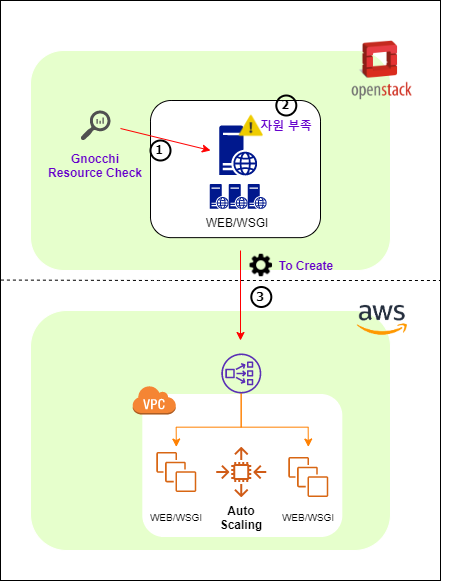

# heat_aws_autoscaling
Process 
</img>  
**Scale OUT**  
    → 인스턴스의 CPU 5분 평균 사용률 70% 이상 시 Heat Engine을 통해 서버를 자동 증설 
    → 부하분산을 담당하는 LB에 2분 평균 10,500,000 Bytes 이상 트래픽 발생 시(수강신청 등) 내부에서는 모두 감당하기에 벅찬 자원이 필요. 해당 상황은 서버 다운, 과부하라는 이슈로 이어지기 때문에 AWS Auto Scaling으로 대비하며, AWS CLI Script를 통해 자동으로 생성  

**Scale IN** 
    → 각 인스턴스의 CPU 5분 평균 사용률 15% 이하 시 해당 인스턴스는 자동으로 삭제 
    → LB에 2분 평균 발생하는 트래픽이 15,000 Bytes 이하라면 과부하에 대한 위험요소가 없다고 판단해 AWS CLI Script를 통해 AWS Auto Scaling Group 자동 삭제  